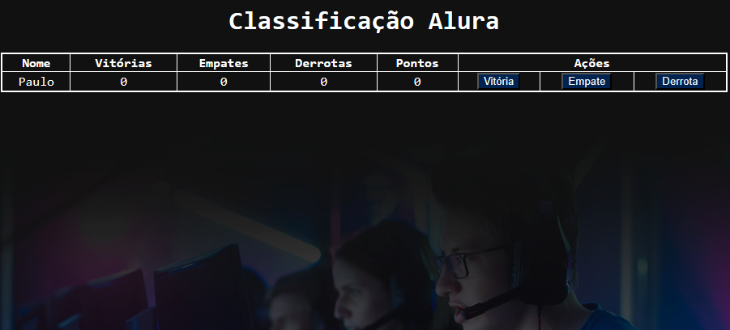

# Tabela de Pontos - Imersão Dev Alura

## Descrição
Projeto desenvolvido durante a quinta aula da 7ª edição da Imersão Dev Alura. O objetivo é construir uma tabela de classificação para acompanhar o desempenho de jogadores, com vitórias, empates, derrotas e pontos, utilizando JavaScript para atualizar dinamicamente os dados.

## Funcionalidades
* Exibe uma tabela de classificação com nome do jogador, vitórias, empates, derrotas e pontos.
* Atualização dinâmica dos dados ao clicar nos botões de vitória, empate ou derrota.
* Cálculo automático da pontuação, onde: Vitória vale 3 pontos; Empate vale 1 ponto; Derrota não pontua.

## Tecnologias Utilizadas
* HTML5
* CSS3 (arquivo externo style.css)
* JavaScript (arquivo externo codigo.js)

